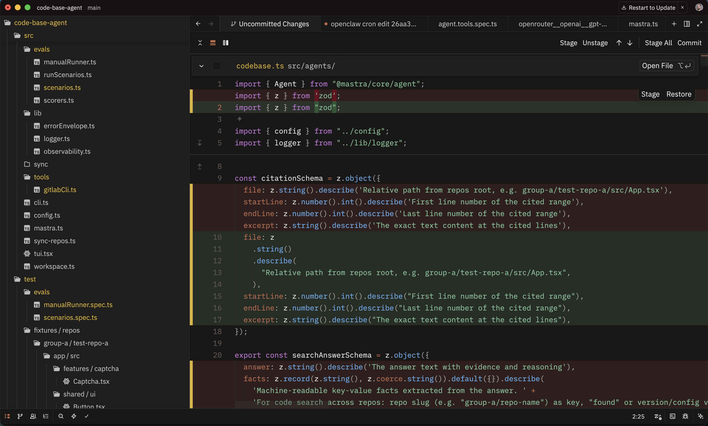
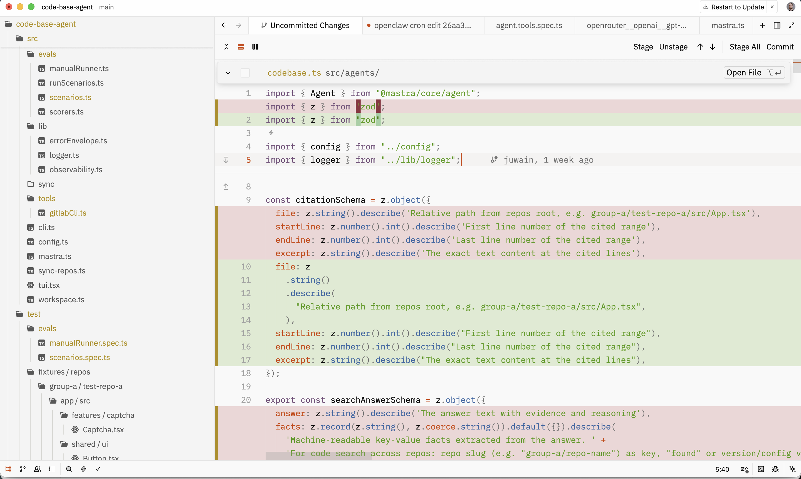

# Superset Theme for Zed

A warm, carefully crafted color theme for the [Zed](https://zed.dev) editor. Includes dark and light variants.


## Preview





## Installation

Copy the theme files to your Zed themes directory:

```sh
mkdir -p ~/.config/zed/themes
cp superset-dark.json superset-light.json ~/.config/zed/themes/
```

Then open Zed and select the theme via `Cmd+K Cmd+T` (macOS) or `Ctrl+K Ctrl+T` (Linux).

## Palette

### Dark

| Role       | Color     | Preview |
|------------|-----------|---------|
| Background | `#151110` |  |
| Foreground | `#eae8e6` |  |
| Accent     | `#c06a4c` |  |
| Red        | `#c75c5c` |  |
| Green      | `#7ec699` |  |
| Yellow     | `#dab530` |  |
| Blue       | `#61afef` |  |
| Purple     | `#c678dd` |  |
| Cyan       | `#56b6c2` |  |

### Light

| Role       | Color     | Preview |
|------------|-----------|---------|
| Background | `#fefefe` |  |
| Foreground | `#0a0a0a` |  |
| Accent     | `#d04200` |  |
| Red        | `#b52020` |  |
| Green      | `#4e9a06` |  |
| Yellow     | `#b08d08` |  |
| Blue       | `#3465a4` |  |
| Purple     | `#75507b` |  |
| Cyan       | `#06989a` |  |

## License

MIT
